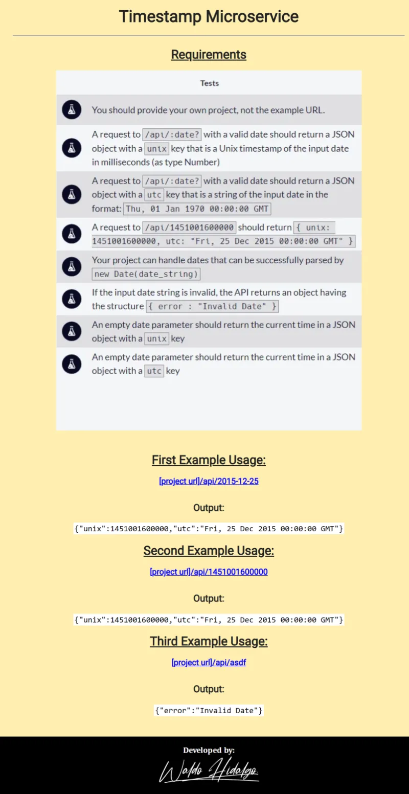

# Timestamp Microservice

Primer proyecto requisito obligatorio para obtener la [**Back End Development and APIs Certification**](https://www.freecodecamp.org/learn/back-end-development-and-apis/back-end-development-and-apis-projects/timestamp-microservice) de freecodecamp.

## Requisitos

Los requisitos del proyecto son los siguientes:

## Screenshots

### 1. Home Page

### 2. First Example

### 2. Second Example

### 2. Third Example

